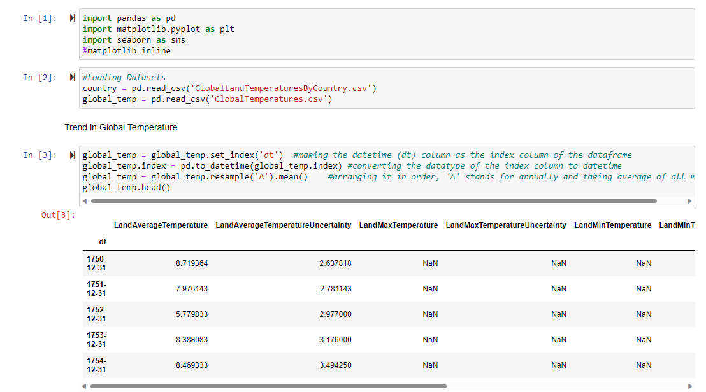
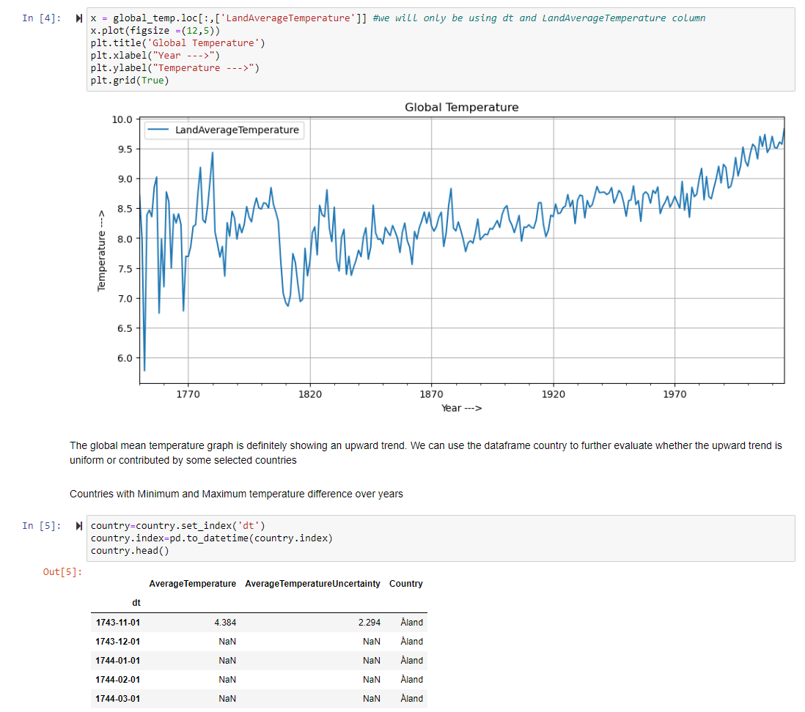
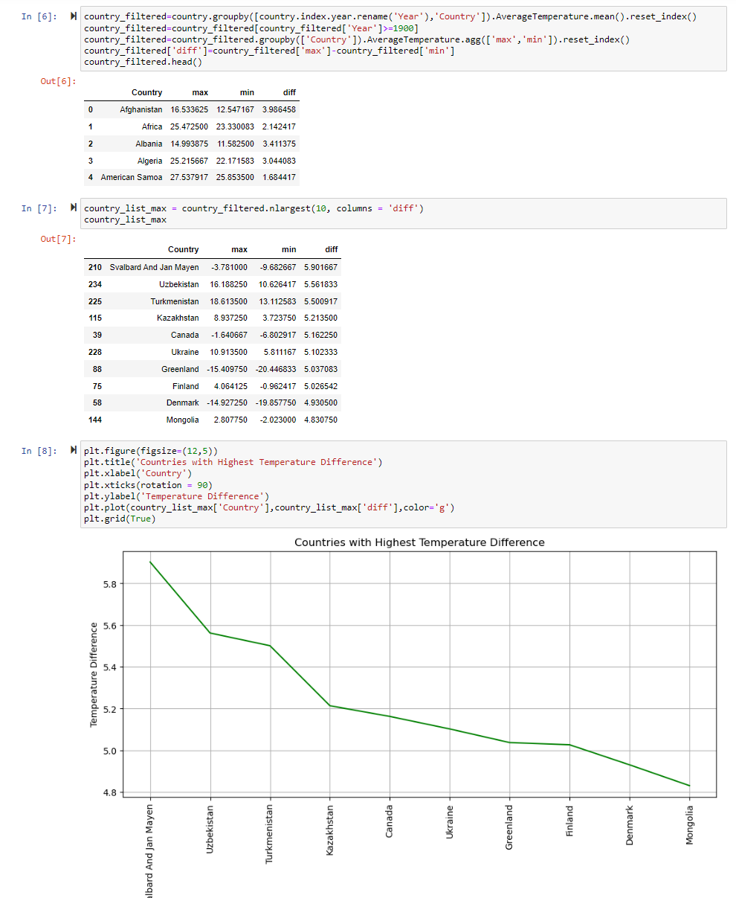
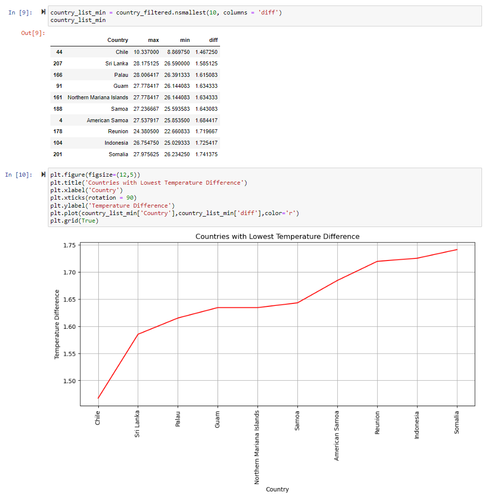
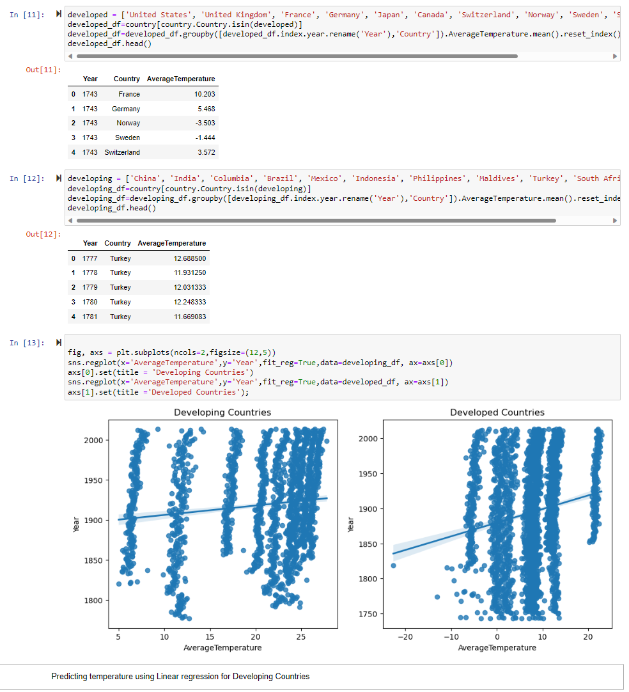
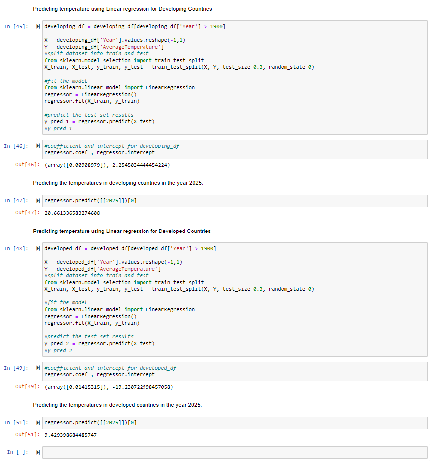

# Global-Temperature-Analysis

## Goal

The aim is to find interesting trends in Land Temperature across different countries, since the year 1700. And create a linear regression model to predict temperature in 2025.

1. We will try to observe the change over the years.
2. The difference between developed and developing countries.
3. Which geographical locations has global warming impacted most?

## Data

We posses two csv files containing the land temperature of each country, taken on the first day of every month, from 1750 to 2013.

## Imports 

Our Jupyter code uses fairly simple libraries:

1) Pandas; for data manipulation
2) Matplotlib and Seaborn; for data visualization
3) Sklearn; for Linear Regression

## Code - Explained

### Import libraries, Collecting and Cleaning Data

- Import all required libraries
- Store the data from csv files (via pandas)
- Set date as our index and change it to a datetime format, to sort the table
- Take the average of my 12 data points from each year, to come up with a annual temperature

### Create a timeline and segregate data per country

- Create a plot diagram to magnify the result of global warming since 1900
- Create a new table, to get temperature trends per country

### Generate a table to showcase the maximum difference between the highest and lowest yearly temperature in each country

- Find the maximum difference in temperature for each country
- Find 10 countries which show the maximum difference and plot them in a graph

### Find 10 countries with least temperature difference since 1900 to highlight geographical trends of global warming

- Find 10 countries which show the minimum difference and plot them in a graph
- Our conclusion is evident, global warming has significantly impacted countries on the two poles compared to the countries around the equator 

### Find trends between developed and developing nations

- 10 devloped and developing countries were randomly choosen from [wikipedia](https://en.wikipedia.org/wiki/Developing_country)(https://en.wikipedia.org/wiki/Developed_country)
- Segrated them into two different tables with their yearly temperature averages
- Create two subplots to highlight the astonishing differences between the two different types of nations

### Use linear regression to predict land temperature in 2025

- We will set apart test and train data set using `train_test_split` from sklearn. This will randomly set aside 30% data for testing
- Using sklearn, we will create a linear regression model and train the 70% data
- Our predictions indicate that avg temperature in developing countries will not only increase, but increase at a higher rate compared to developed countries.

